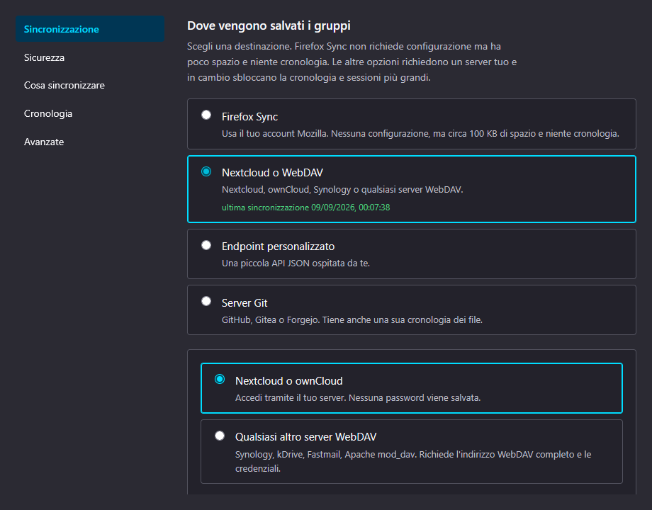
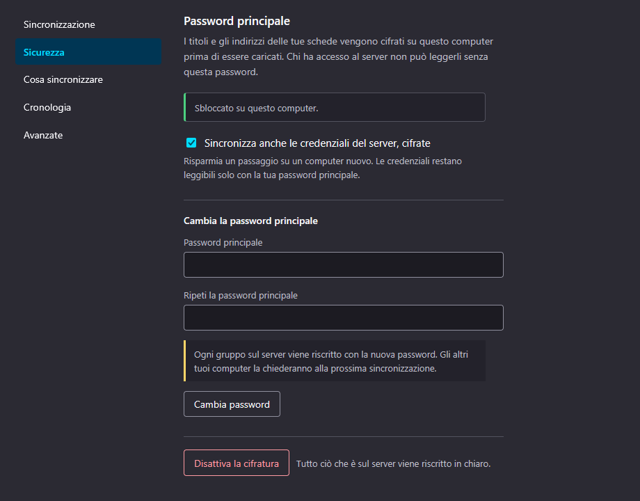
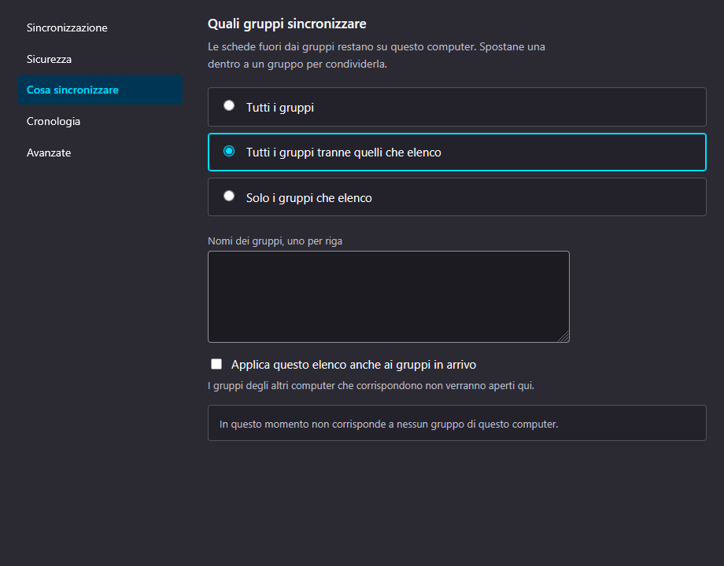

# Tab Groups Sync &amp; Restore

A Firefox extension that syncs your tab groups between computers using a server
you choose, and brings them back from history when one gets closed by mistake.

Firefox syncs open tabs across devices but not the groups they belong to. This
fills that gap, without requiring you to trust anyone's cloud but your own.

- **One file per computer.** Nobody writes to anyone else's file, so there is
  nothing to merge and concurrent writes cannot happen. The file is named after
  the computer, so reinstalling and typing the same name resumes it.
- **Nothing is applied on its own.** When another computer changes, you are
  offered three answers: add its groups here, replace yours with them, or
  dismiss the notice.
- **Four destinations.** Firefox Sync with no setup, or Nextcloud/WebDAV, a Git
  host, or a small JSON endpoint you run yourself. Each keeps its own settings,
  so switching between them is reversible.
- **Optional end-to-end encryption.** Titles and addresses are sealed on your
  computer before they are uploaded. The passphrase never leaves it.
- **History.** Snapshots of your groups, per computer, so a group closed by
  mistake can be brought back.
- **English and Italian.**

## What it looks like

Screenshots are of the Italian interface; the extension ships in English and
Italian and follows the browser's language.

**Choosing where your groups are stored.** Each destination keeps its own
settings, so switching between them and switching back costs nothing.



**Encryption is optional and yours.** The passphrase never leaves the computer.
Changing it rewrites every file on the server; the other computers are asked for
the new one rather than failing quietly.



**Not everything has to travel.** The group filter is per computer, so the same
folder can hold a shared base while each machine keeps what belongs only to it.
Tabs outside a group never leave the machine at all.



---

Requires Firefox 140 or later. The `tabGroups` API landed in 139, but 140 is
where `data_collection_permissions` is honoured, and an install that silently
drops the data-collection notice is not one worth allowing.

The extension transmits tab addresses and titles to the destination you choose,
so it declares `browsingActivity`. Encryption is a safeguard on that
transmission, not a reason to omit the declaration.

---

## Layout

```
extension/     the add-on itself; this folder is what gets zipped for AMO
server/        reference implementation of the self-hosted endpoint
docs/          design notes, self-hosting guide, testing guide
```

One repository rather than two, deliberately: the JSON contract between the
extension and the endpoint has to change in lockstep, and splitting them would
mean coordinating two releases every time a field is added.

## Install for development

```
about:debugging#/runtime/this-firefox → Load Temporary Add-on → extension/manifest.json
```

Temporary add-ons lose optional permissions when reloaded, so you may be asked
to grant server access again after each reload.

## Building a release

```
./build.sh
```

The zip must contain `manifest.json` at its root, not inside a folder. Getting
that wrong is rejected by AMO with a message about packaging — and, less
obviously, makes the linter unable to read `browser_specific_settings.gecko.id`,
so every `storage.sync` call is then reported as unsafe. The script checks the
layout before it finishes.

## Checks

```
npx eslint .
./build.sh          # packages and runs Mozilla's addons-linter
```

`no-undef` matters more than usual here: the extension is loaded as ES modules
with no build step, so a name that is used but never imported fails only at the
moment the user clicks the thing.

## Documentation

- [How it works](docs/design.md) — data model, merge rules, encryption
- [Self-hosting](docs/self-hosting.md) — running your own endpoint
- [Testing](docs/testing.md) — how to exercise it without two computers
- [Privacy policy](docs/privacy-policy.md) — what is handled, and where it goes
- [AMO listing copy](docs/amo-listing.md) and
  [reviewer notes](docs/reviewer-notes.md) — kept in the repo so they stay in
  step with the code they describe

## License

GNU General Public License v3.0. See [LICENSE](LICENSE).
